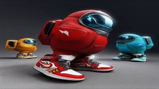

# Tema 1

En este tema se verán los ***conceptos básicos***


Se verán los siguientes apartados:

1. asd
2. asd   
3. asd
4. asd
5. ~~asd~~

---

Lenguaje    |  Inventor   |   Año
------------|:-------------:|--------:
Javascript  | Manolo      | 1995
Java        | Paco        | 1995
Python      | Pepe        | 1999


```java
import System.out.println;

void main(String args[]){
  println('Hola');
}

```


> **Aviso**: Esto debe escribirse en un terminal.
> 
> aaaaaaaaaaaaaaaaaaaa
> ```javascript
> var numero = 5;
> ```


